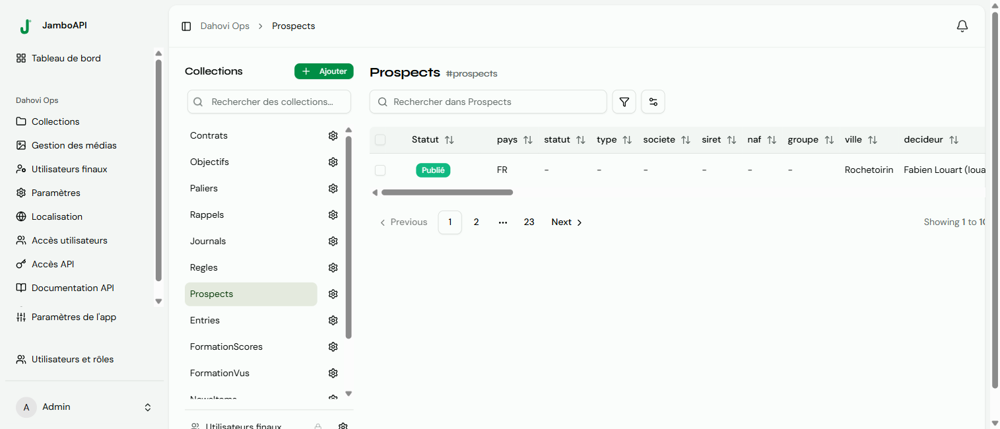

## Overview



A **Content Entry** is an instance of a Collection. Each entry stores field values in an EAV structure and carries metadata such as status, locale, timestamps, and user assignments.

The `ContentEntry` entity (`src/Entity/ContentEntry.php`) represents a single piece of content.

## Entry properties

| Property | Type | Default | Description |
|---|---|---|---|
| `id` | `int` | auto | Primary key |
| `uuid` | `uuid` | auto | Unique UUIDv4 |
| `status` | `string` | `'draft'` | Workflow status |
| `locale` | `string` | `'en'` | Entry locale |
| `assignedTo` | `?User` | `null` | Assigned reviewer/editor |
| `createdBy` | `?User` | auto | Entry creator |
| `updatedBy` | `?User` | auto | Last editor |
| `createdAt` | `datetime` | auto | Creation timestamp |
| `updatedAt` | `datetime` | auto | Last update timestamp |
| `publishedAt` | `?datetime` | `null` | First publication timestamp |
| `scheduledAt` | `?datetime` | `null` | Scheduled publish time |
| `deletedAt` | `?datetime` | `null` | Soft-delete timestamp |
| `fieldValues` | `Collection` | — | EAV field values |

## Status lifecycle

The `status` property drives the content workflow. When an entry transitions:

- **draft → published**: auto-sets `publishedAt` to the current timestamp
- **scheduled → published**: auto-clears `scheduledAt`
- **published → draft**: no automatic effects

Status values are validated against the collection's workflow configuration (see [Workflows](/features/workflows/)).

## Scheduling

Entries can be scheduled for future publication. Set `status` to `"scheduled"` and provide a `scheduledAt` timestamp. A console command (`app:publish-scheduled`, from `src/Command/PublishScheduledEntriesCommand.php`) transitions scheduled entries to `"published"` when their time arrives.

## Soft delete

Entries are soft-deleted by setting `deletedAt` to the current timestamp. Deleted entries are excluded from all default queries and moved to the **trash**. They can be restored or permanently deleted.

## Versioning

Jambo automatically creates a **version snapshot** each time an entry's field values are updated. Versions are stored in `ContentVersion` (`src/Entity/ContentVersion.php`):

| Property | Description |
|---|---|
| `snapshot` | Full JSON snapshot of all field values |
| `versionNumber` | Auto-incrementing version number per entry |
| `label` | Human label (e.g. "Sauvegarde" for auto-saved) |
| `createdBy` | User who triggered the version |
| `createdAt` | Version timestamp |

Version endpoints:

| Method | Endpoint | Description |
|---|---|---|
| `GET` | `/entries/{uuid}/versions` | List all versions |
| `POST` | `/entries/{uuid}/versions/{v}/restore` | Restore a specific version |
| `GET` | `/entries/{uuid}/versions/diff?v1=X&v2=Y` | Diff between two versions |

## API endpoints

### Studio API

Base URL: `/api/projects/{projectUuid}/collections/{collectionSlug}/entries`

| Method | Endpoint | Description |
|---|---|---|
| `GET` | `` | List entries (paginated) |
| `GET` | `/trash` | List soft-deleted entries |
| `POST` | `` | Create a new entry |
| `GET` | `/{uuid}` | Get a single entry |
| `PUT/PATCH` | `/{uuid}` | Update entry |
| `POST` | `/{uuid}/duplicate` | Duplicate entry as a new draft |
| `DELETE` | `/{uuid}` | Soft-delete entry |
| `PATCH` | `/{uuid}/restore` | Restore trashed entry |
| `DELETE` | `/{uuid}/force-delete` | Permanently delete entry |

Query parameters for listing: `page`, `per_page` (default 15, max 100), `locale`, `status`.

#### Create an entry

```json
// POST /api/projects/{uuid}/collections/blog_posts/entries
{
  "status": "draft",
  "locale": "en",
  "fields": {
    "title": "Hello World",
    "body": "This is my first blog post."
  }
}
```

#### Update an entry with status change

```json
// PUT /api/projects/{uuid}/collections/blog_posts/entries/{entryUuid}
{
  "status": "published",
  "fields": {
    "title": "Hello World (Updated)"
  }
}
```

### Public API

Base URL: `/api/{projectId}/{collectionSlug}`

| Method | Endpoint | Description |
|---|---|---|
| `GET` | `` | List published entries |
| `GET` | `/{uuid}` | Get a single entry |
| `POST` | `` | Create entry (requires `create` ability) |
| `PATCH` | `/{uuid}` | Update entry (requires `create` ability) |
| `DELETE` | `/{uuid}` | Soft-delete (requires `delete` ability) |

The public API defaults to returning only published entries and requires authentication via API token.

## Entry response format

Field values are flattened into the response at the top level. Reserved keys are always present:

```json
{
  "id": 1,
  "uuid": "550e8400-e29b-41d4-a716-446655440000",
  "locale": "en",
  "status": "published",
  "collection": "blog_posts",
  "created_at": "2025-01-01T00:00:00+00:00",
  "updated_at": "2025-01-01T00:00:00+00:00",
  "published_at": "2025-01-01T00:00:00+00:00",
  "title": "Hello World",
  "body": "<p>Content</p>"
}
```

## Events

Content operations dispatch events that power Flows, webhooks, and real-time updates:

| Event | Triggered when |
|---|---|
| `content.created` | Entry created via any surface |
| `content.updated` | Entry updated |
| `content.deleted` | Entry soft-deleted |
| `content.status_changed` | Entry `status` value changes |

## See also

- [Collections](/features/collections/) — content type definitions
- [Fields](/features/fields/) — field types and validation
- [Workflows](/features/workflows/) — custom status management
- [Localization](/features/localization/) — multi-locale entries
