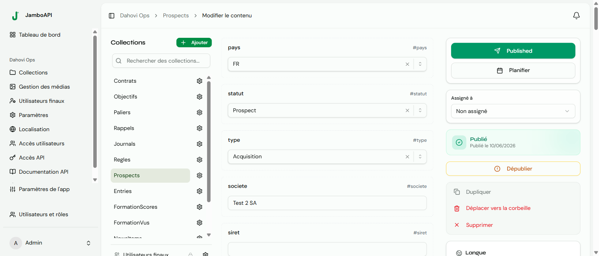

The Live Preview system lets content editors preview entries in their frontend application context before publishing. It combines JWT-based authentication, iframe + postMessage communication, and visual in-context editing.

## Architecture

```
Jambo Admin (React)
    │
    │  GET /api/projects/{uuid}/preview/token/{entryUuid}
    │  ──► PreviewTokenService.createToken(entry) ──► JWT
    │
    │  Opens iframe with ?jambo_preview=<JWT>&jambo_entry=<uuid>
    │  ──► iframe loads external frontend URL
    │
    │  postMessage (jambo-ready) ──►─┐
    │  ◄── postMessage (jambo-init)  │  SDK: @jambostack/live-preview
    │  postMessage (jambo-update) ──►│
    │  ◄── postMessage (Visual Edit) │  initVisualEditing()
    │
    ▼
Frontend (Next.js, any framework)
    │
    │  GET /api/projects/{uuid}/preview/content/{col}/{eid}
    │  ──► Authorization: Bearer <JWT>
    │  ◄── Entry data (including drafts)
```

## Preview Token Service

Located at `src/Service/PreviewTokenService.php`. Generates and validates JWT tokens for draft/published entry access.

### Token generation

```php
$tokenService->createToken($entry);
// Returns a JWT string valid for 1 hour (3600 seconds)
```

**JWT claims:**

| Claim | Value | Description |
|---|---|---|
| `sub` | `preview` | Fixed subject identifier |
| `pid` | `{project_uuid}` | Project UUID |
| `eid` | `{entry_uuid}` | Entry UUID |
| `col` | `{collection_slug}` | Collection slug |
| `status` | `draft` or `published` | Entry status at token creation time |
| `iat` | timestamp | Issued at |
| `exp` | timestamp + 3600 | Expires at |

**Algorithm:** HS256 (HMAC-SHA256) using the application secret.

### Token validation

```php
$claims = $tokenService->validateToken($token);
// Returns null if invalid or expired
// Returns ['sub', 'pid', 'eid', 'col', 'status'] if valid
```

## Preview API Endpoints

Both endpoints are at `/api/projects/{projectUuid}/preview`.

### Generate a preview token (admin only)

```
GET /api/projects/{projectUuid}/preview/token/{entryUuid}
```

Requires `project.view` permission.

```json
{
  "token": "eyJhbGciOiJIUzI1NiIs...",
  "expires_in": 3600
}
```

### Access entry content via token (public)

```
GET /api/projects/{projectUuid}/preview/content/{collection}/{entryUuid}
Authorization: Bearer <preview_token>
```

Returns the full entry data (same format as the admin API), including draft content. The endpoint validates:
- Token signature and expiry
- Token matches the project, entry, and collection
- `previewEnabled` is true for the project

## iframe + postMessage Protocol

### Embedding

The admin opens an iframe pointing to the frontend preview URL with query parameters:

```
https://frontend.com/blog/{slug}?jambo_preview=<JWT>&jambo_entry=<uuid>&jambo_collection=<slug>&jambo_locale=en&jambo_project=<uuid>
```

The iframe uses `sandbox="allow-scripts allow-same-origin"`.

### Message flow

```
1. iframe loads ──────► postMessage({ type: 'jambo-ready' })
2. Admin receives     ◄──
3. Admin sends        ──► postMessage({ type: 'jambo-init', collection, entryUuid, locale, previewToken, projectUuid })
4. iframe initializes ◄── (fetches entry data using the token)
5. Admin sends        ──► postMessage({ type: 'jambo-update', fields: {...}, changedFields: [...] })  [debounced 500ms]
6. iframe updates     ◄──
```

The message origin is validated against the preview URL's origin (via `getTargetOrigin()`).

### Device emulation

The admin panel provides desktop, tablet (768px), and mobile (375px) viewport toggles.

## SDK: `@jambostack/live-preview`

The SDK package at `packages/live-preview/` provides two entry points.

### Core API (any framework)

```ts
import { subscribe } from '@jambostack/live-preview/core';

const unsub = subscribe({
  onInit: async (ctx) => {
    // ctx: { entryUuid, collection, locale, token, projectUuid }
    const res = await fetch(`/api/content/${ctx.collection}/${ctx.entryUuid}`);
    return res.json();
  },
  onUpdate: (data) => {
    document.getElementById('title')!.textContent = data.title;
  },
  debug: true,
});
```

### Next.js integration

```tsx
import { useLivePreview } from '@jambostack/live-preview/next';

export default function BlogPost({ initialData }) {
  const { data, isPreview } = useLivePreview({ initialData });

  return (
    <article>
      <h1>{data.title}</h1>
      <div dangerouslySetInnerHTML={{ __html: data.body }} />
    </article>
  );
}
```

## Visual Editing (v1.14b)

Visual Editing lets editors click on content directly in the preview iframe and see the corresponding field highlighted in the admin panel.

### Frontend setup

Add `data-jambo-*` attributes to HTML elements:

```tsx
const { data, isPreview, fieldProps } = useLivePreview({ initialData });

return (
  <article>
    <h1 {...fieldProps('title', 'text')}>{data.title}</h1>
    <div {...fieldProps('body', 'richtext')}>
      <RichText content={data.body} />
    </div>
    
  </article>
);
```

This renders as:

```html
<h1 data-jambo-field="title" data-jambo-type="text">Hello World</h1>
```

### PostMessage protocol for visual editing

| Message | Direction | Description |
|---|---|---|
| `jambo-hover-field` | iframe -> admin | Mouse enters a `[data-jambo-field]` element |
| `jambo-select-field` | iframe -> admin | Click on a field element |
| `jambo-inline-update` | iframe -> admin | Inline edit popover submitted |
| `jambo-highlight-clear` | admin -> iframe | Clear hover highlights |
| `jambo-popover-close` | admin -> iframe | Close inline edit popover |

### Inline editing

Editable field types: `text`, `textarea`, `number`, `email`, `url`, `slug`.

When a user clicks an editable element, a popover appears with an input field. On "Apply", the new value is sent back to the admin via `jambo-inline-update`, which calls `onInlineUpdate(fieldSlug, value)`.

### Visual Editing SDK (vanilla)

```ts
import { initVisualEditing } from '@jambostack/live-preview/core';

const cleanup = initVisualEditing({
  allowedOrigin: 'https://admin.jambo.com',
  inlineEditEnabled: true,
  debug: true,
});
```

The SDK:
1. Injects CSS styles for hover outlines
2. Uses a `MutationObserver` to detect dynamically added `[data-jambo-field]` elements
3. Sends hover/click events to the admin parent window
4. Displays an inline edit popover on click
5. Returns a cleanup function

## Configuration

Preview is enabled per-project via the `previewEnabled` boolean field on the `Project` entity. Tokens are signed with the application secret (`%env(APP_SECRET)%`).

## Key files

| File | Purpose |
|---|---|
| `src/Service/PreviewTokenService.php` | JWT generation and validation |
| `src/Controller/PreviewController.php` | Preview token and content endpoints |
| `assets/js/components/LivePreviewPanel.tsx` | React Live Preview panel with iframe |
| `packages/live-preview/core/index.ts` | SDK: subscribe() and initVisualEditing() |
| `packages/live-preview/next/index.ts` | SDK: useLivePreview() React hook |
| `packages/live-preview/package.json` | npm package: `@jambostack/live-preview` |
