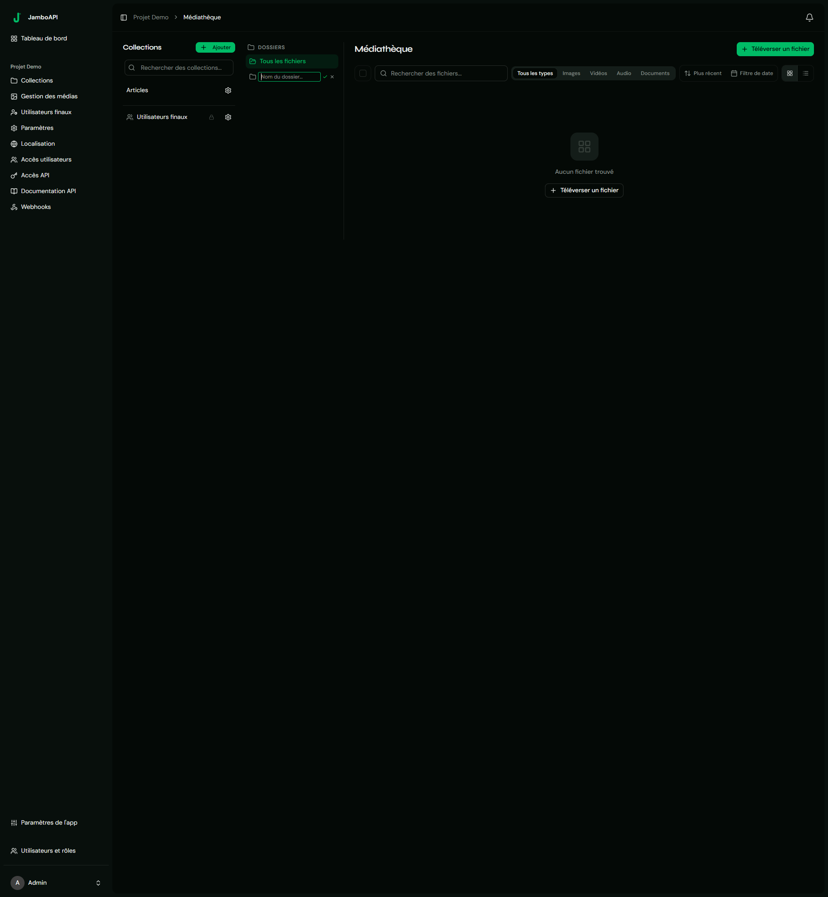

## Overview



Jambo.s media system handles file storage, organization, and delivery. It supports three upload paths, folder organization, on-the-fly image transformations, and multi-storage mirroring (local + S3-compatible).

## The Media entity

The `Media` entity (`src/Entity/Media.php`) stores file metadata:

| Property | Type | Description |
|---|---|---|
| `uuid` | `uuid` | Unique UUIDv4 |
| `fileName` | `string` | Unique filename on disk |
| `originalName` | `string` | Client's original filename |
| `mimeType` | `string` | MIME type (e.g. `image/jpeg`) |
| `fileSize` | `int` | Size in bytes |
| `alt` | `string|null` | Alt text |
| `caption` | `string|null` | Caption |
| `folder` | `MediaFolder|null` | Parent folder |
| `metadata` | `AssetMetadata|null` | Image dimensions |
| `storageProfile` | `ProjectStorageProfile|null` | Storage configuration |
| `storagePaths` | `json|null` | Per-profile path map |
| `deletedAt` | `datetime|null` | Soft-delete timestamp |

## Media folders

Folders (`src/Entity/MediaFolder.php`) use an adjacency list model — each folder can have a `parent` and multiple `children`.

| Method | Endpoint | Description |
|---|---|---|
| `GET` | `/api/projects/{uuid}/media-folders` | List all folders |
| `GET` | `/api/projects/{uuid}/media-folders/tree` | Nested tree structure |
| `POST` | `/api/projects/{uuid}/media-folders` | Create folder |
| `PUT/PATCH` | `/{id}` | Rename folder |
| `PATCH` | `/{id}/move` | Move folder (change parent) |
| `DELETE` | `/{id}` | Soft-delete folder |

## Upload methods

### 1. Direct upload (Studio)

```http
POST /api/projects/{projectUuid}/media
Content-Type: multipart/form-data

file: <binary>
alt: "Photo description"
caption: "Caption text"
folder_id: 3
```

Uses **VichUploaderBundle** with `UniqidNamer` to generate unique filenames. Files are stored at `public/uploads/media/{projectUuid}/{uniqueid}.{ext}`.

### 2. TUS resumable upload

For large files and unreliable connections, Jambo implements the **TUS 1.0.0 protocol** (`src/Controller/TusController.php`, `src/Service/TusServer.php`).

```
POST /api/projects/{projectUuid}/files/tus
Tus-Resumable: 1.0.0
Upload-Length: 10485760
Upload-Metadata: filename <base64>,filetype <base64>
```

Workflow:
1. `POST` — Create an upload session, returns an `uploadId`
2. `PATCH /{uploadId}` — Send chunks with `Upload-Offset` header
3. `HEAD /{uploadId}` — Query current offset
4. `POST /{uploadId}/finalize` — Finalize and create the Media entity

Allowed extensions (from `TusController::ALLOWED_EXTENSIONS`):

| Category | Extensions |
|---|---|
| Images | `jpg`, `jpeg`, `png`, `gif`, `webp`, `avif`, `svg` |
| Video | `mp4`, `webm`, `mov`, `avi` |
| Audio | `mp3`, `wav`, `ogg`, `aac`, `flac` |
| Documents | `pdf`, `doc`, `docx`, `xls`, `xlsx`, `ppt`, `pptx` |
| Data | `txt`, `csv`, `json`, `xml`, `yaml`, `yml` |
| Archives | `zip`, `gz`, `tar` |

### 3. Public API upload

```http
POST /api/{projectId}/files
Authorization: Bearer <token>
Content-Type: multipart/form-data

file: <binary>
```

Limited to **10 MB** max file size. Requires the project's `publicApi` setting to be enabled.

## Image transformations

On-the-fly image transforms are served through the CDN endpoint (`src/Controller/ImageTransformController.php`):

```
GET /cdn/media/{uuid}?w=800&h=600&fit=cover&fmt=webp&q=80
```

Query parameters (all optional):

| Parameter | Values | Default | Description |
|---|---|---|---|
| `w` | 1–4000 | original | Target width |
| `h` | 1–4000 | original | Target height |
| `fit` | `contain`, `cover`, `fill`, `crop`, `scale-down` | — | Fit mode |
| `fmt` | `webp`, `avif`, `png`, `jpg`, `gif` | original | Output format |
| `q` | 1–100 | 90 | Quality |
| `bg` | hex color | — | Background for `fill` mode |

Transforms are cached at `public/uploads/media/cache/` with a `max-age=31536000, immutable` cache header. Uses **Intervention Image v4** with Imagick or GD.

## Storage strategies

Jambo supports multi-storage mirroring via `src/Service/StorageManager.php`:

| Strategy | Behavior |
|---|---|
| `default_only` | Write to the default storage only |
| `mirror_all` | Write to every active storage profile |
| `rules` | Evaluate rules by MIME type, filename, size |

Storage profiles can define **local** (filesystem) or **S3-compatible** drivers. S3 secrets are encrypted at rest using libsodium secretbox.

## Media querying

The Studio media listing supports filtering and sorting:

| Parameter | Values |
|---|---|
| `type` | `image`, `video`, `audio`, `document`, `other` |
| `date_filter` | `today`, `week`, `month`, `quarter` |
| `sort` | `newest`, `oldest`, `name`, `size` |
| `search` | Search by filename |
| `folder_id` | Filter by folder |

## See also

- [Fields](/features/fields/) — media field type for content
- [Localization](/features/localization/) — locale-aware content
